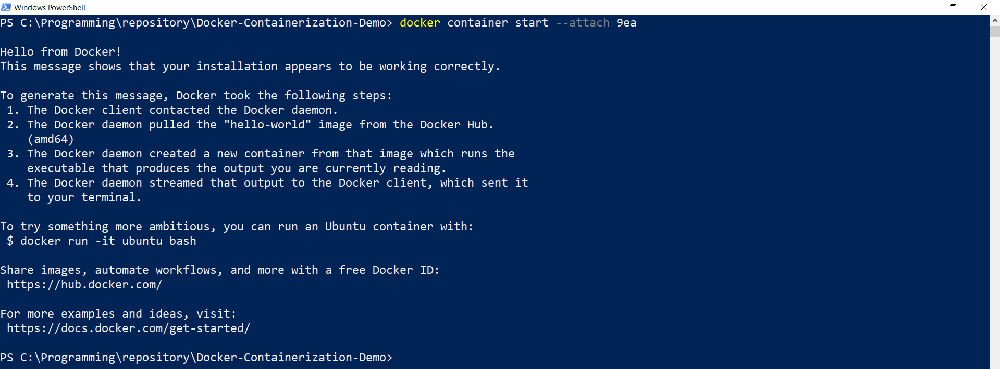
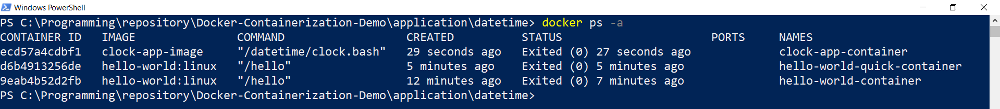
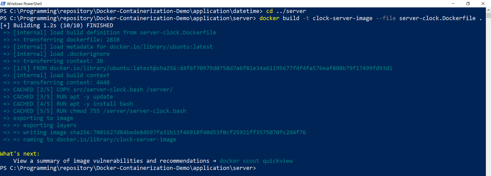
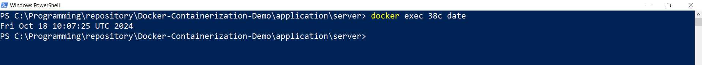

# Docker Containerization Demo

_Containerize backend services using Docker CLI, Dockerfile and Docker Compose_

Demo is based on LinkedIn Learning courses:
- [Learning Docker](https://www.linkedin.com/learning/learning-docker-17236240)
- 

#### Tech stack

- Docker Desktop
- Docker CLI
- Dockerfile
- Docker Compose
- Windows 10
- IntelliJ IDEA

#### Content

* [Preparation](#preparation)
* [CLI basics](#cli-basics)
* [Dockerfile](#dockerfile)
* [Service container](#service-container)

#### Preparation

Before we can use Docker in Windows we have to install Docker Desktop and run it as described
[here](https://docs.docker.com/desktop/install/windows-install/).

Once Docker Desktop is up and running we are ready to go.
Let's open PowerShell and check if docker is available:

- Run `docker version`

#### CLI basics

There is an explicit way to create and start container:

- Run `docker container create hello-world:linux`

As we can see, `hello-world` image found in docker hub, 
meaning we don't need to create our own image, instead we can use existing one.

- Run `docker ps -a` 

We checked for all existing containers and see that our one was successfully created.

- Run `docker container start a53` (replace `a53` with your actual container id)

- Run `docker ps -a`

We see that our container has exited means it was successfully run and stopped 
as it has no continuous task, just prints some output.
Let's check what was printed:

- Run `docker logs a53` (replace `a53` with your actual container id)

In order to enter execution process, we can start container this way:

- Run `docker container start --attach a53`

Now, we are going to try shorter way to create and start container:

- Run `docker run hello-world:linux`

- Run `docker ps -a`

It took just one command to execute container interactively.

#### Dockerfile

Now, we have simple program as `clock.bash` app source [here](application/datetime/src/clock.bash). 
So, we can create container based on our own image 
using `Dockerfile` as [here](application/datetime/Dockerfile).

- Go to `application/datetime` directory
- Run `docker build -t clock-app-image .`

From 2 last lines of output we see that image was created and named.
So, we are ready to run new container based on that image:

- Run `docker run clock-app-image`

We got simple line output from our application and now can check container state:

- Run `docker ps -a`

#### Service container

Now we will interact with app that works continuously like a server.
For this we have `server-clock.bash` app source [here](application/server/src/server-clock.bash)
and corresponding `server-clock.Dockerfile` [here](application/server/server-clock.Dockerfile).

- Go to `server` directory
- Run `docker build -t clock-server-image --file server-clock.Dockerfile .`

- Run `docker run --name clock-server-container -d clock-server-image`

- Run `docker ps`

- Run `docker logs 86f` (replace `86f` with your actual container id)

- Run `docker exec 86f date`

As our server is running forever, we have to stop it manually:

- Run `docker stop 86f` (replace `86f` with your actual container id)

- Run `docker ps -a`

