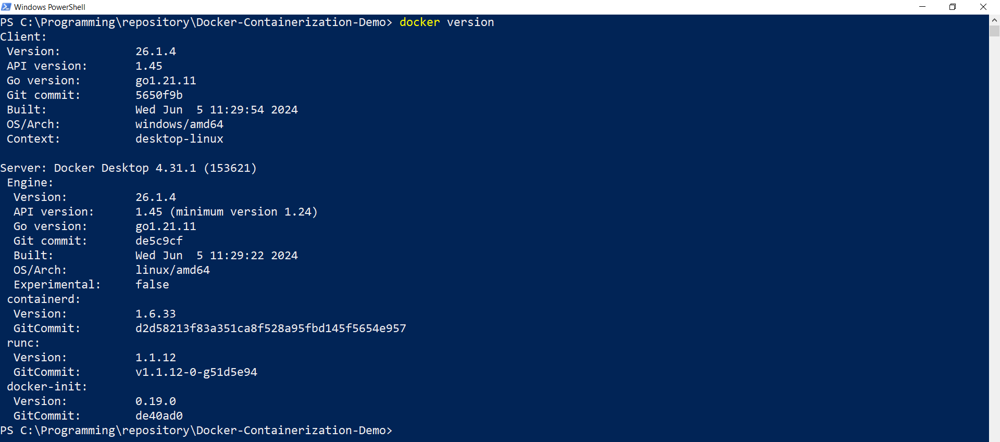
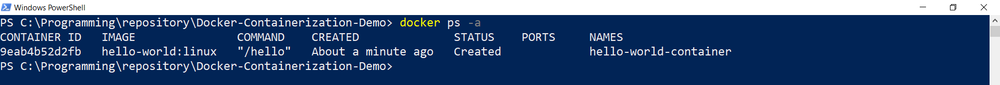
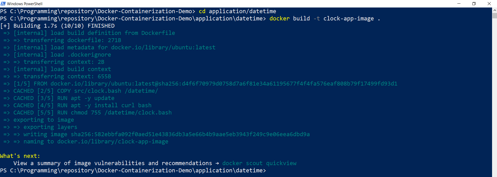
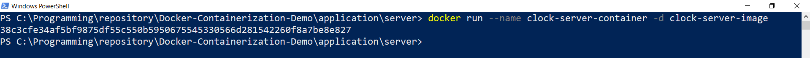
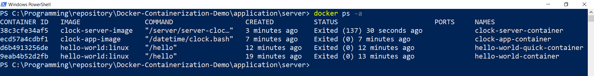
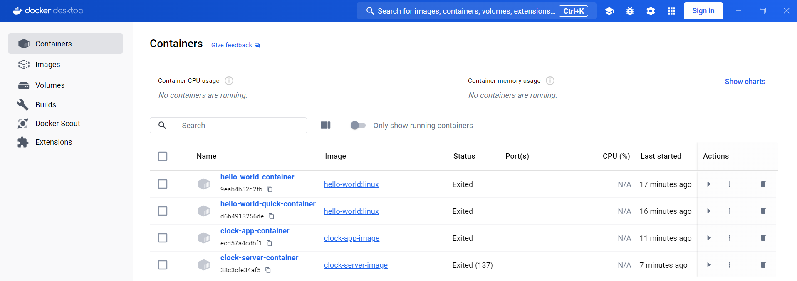
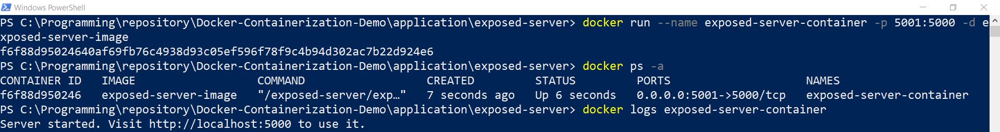

# Docker Containerization Demo

_Containerize backend services using Docker CLI, Dockerfile and Docker Compose_

Demo is based on LinkedIn Learning courses:
- [Learning Docker](https://www.linkedin.com/learning/learning-docker-17236240)
- [Docker: Your First Project](https://www.linkedin.com/learning/docker-your-first-project)
- [Learning Docker Compose](https://www.linkedin.com/learning/learning-docker-compose)

#### Tech stack

- Docker Desktop
- Docker CLI
- Dockerfile
- Docker Compose
- Windows 10
- IntelliJ IDEA

#### Content

* [Preparation](#preparation)
* [Fundamentals](#fundamentals)
    * [Containerize function with CLI](#containerize-function-with-cli)
    * [Build and Containerize function with Dockerfile](#build-and-containerize-function-with-dockerfile)
    * [Build and Containerize service with Dockerfile](#build-and-containerize-service-with-dockerfile)
    * [Cleanup](#cleanup)    
* [Docker Project](#docker-project)
* [Docker Compose](#docker-compose)

## Preparation

Before we can use Docker in Windows we have to install Docker Desktop and run it as described
[here](https://docs.docker.com/desktop/install/windows-install/).

Once Docker Desktop is up and running we are ready to go.
Let's open PowerShell and check if docker is available:

- Run `docker version`

## Fundamentals

#### Containerize function with CLI

There is an explicit way to create and start container:

- Run `docker container create --name hello-world-container hello-world:linux`

As we can see, `hello-world` image found in docker hub, 
meaning we don't need to create our own image, instead we can use existing one.

- Run `docker ps -a` 

We checked for all existing containers and see that our one was successfully created.

- Run `docker container start 9ea` (replace `9ea` with your actual container id)

- Run `docker ps -a`

We see that our container has exited means it was successfully run and stopped 
as it has no continuous task, just prints some output.
Let's check what was printed:

- Run `docker logs 9ea` (replace `9ea` with your actual container id)

In order to enter execution process, we can start container this way:

- Run `docker container start --attach 9ea`

Now, we are going to try shorter way to create and start container:

- Run `docker run --name hello-world-quick-container hello-world:linux`

- Run `docker ps -a`

It took just one command to execute container interactively.

#### Build and Containerize function with Dockerfile

Now, we have simple program as `clock.bash` app source [here](application/datetime/src/clock.bash). 
So, we can create container based on our own image 
using `Dockerfile` as [here](application/datetime/Dockerfile).

- Go to `application/datetime` directory
- Run `docker build -t clock-app-image .`

From 2 last lines of output we see that image was created and named.
So, we are ready to run new container based on that image:

- Run `docker run --name clock-app-container clock-app-image`

We got simple line output from our application and now can check container state:

- Run `docker ps -a`

#### Build and Containerize service with Dockerfile

Now we will interact with app that works continuously like a server.
For this we have `server-clock.bash` app source [here](application/server/src/server-clock.bash)
and corresponding `server-clock.Dockerfile` [here](application/server/server-clock.Dockerfile).

- Go to `server` directory
- Run `docker build -t clock-server-image --file server-clock.Dockerfile .`

- Run `docker run --name clock-server-container -d clock-server-image`

- Run `docker ps`

- Run `docker logs 38c` (replace `38c` with your actual container id)

- Run `docker exec 38c date`

As our server is running forever, we have to stop it manually:

- Run `docker stop 38c` (replace `38c` with your actual container id)

- Run `docker ps -a`

Also, in Docker Desktop we have nice UI to check our containers:

and images:

#### Cleanup

Once containers are stopped, and we don't need them anymore, 
we can delete resources to free space in our machine:

- Run `docker remove 38c` (where `38c` is your container id)

- Run `docker ps -a`

As we can see, `clock-server-container` is not there anymore.

There is way to delete all containers at once:

- Run `docker ps -aq | ForEach-Object { docker rm $_ }`
- Run `docker ps -a`

Once depending containers are stopped (or deleted),
we are good to delete images as well.
First, let's check what we have:

- Run `docker images`

Now, let's delete first one by tag:

- Run `docker rmi clock-server-image`
- Run `docker images`

As we can see, `clock-server-image` is not there anymore.

In a similar way as for containers, we can delete all images at once:

- Run `docker images -aq | ForEach-Object { docker rmi $_ }`
- Run `docker images`

#### Port Publishing

Up to this point we could have access to our app only through Docker Container.
Is there direct way to make call to app from host machine (our computer)?
Yes, we can expose port of our server following way.

First, let's build image based on `exposed-server.bash` [source file](application/exposed-server/src/exposed-server.bash):

- Go to `exposed-server` directory
- Run `docker build -t exposed-server-image --file exposed-server.Dockerfile .`

Next command will create and run container with port mapping, 
where 5000 is port inside container and 5001 exposed one:

- Run `docker run --name exposed-server-container -p 5001:5000 -d exposed-server-image`
- Run `docker ps -a`
- Run `docker logs exposed-server-container`

We can call our server from inside container like this:

- Run `docker exec -it exposed-server-container bash`
- Type `curl http://localhost:5000`
- Type `exit`

And also have access directly from browser in our computer:

- Open `localhost:5001`

## Docker Project

## Docker Compose

